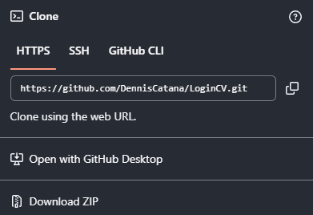
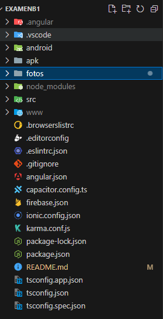
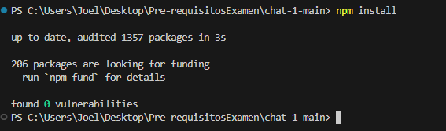
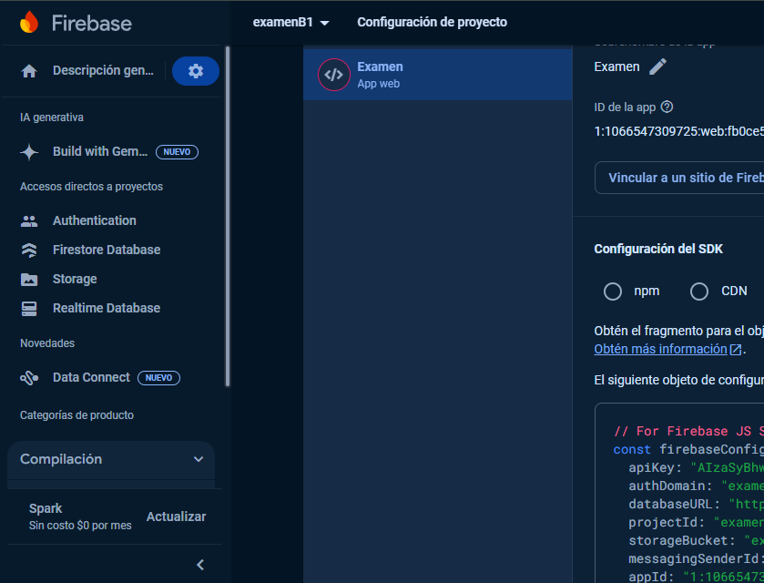
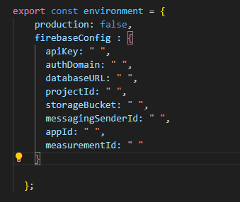
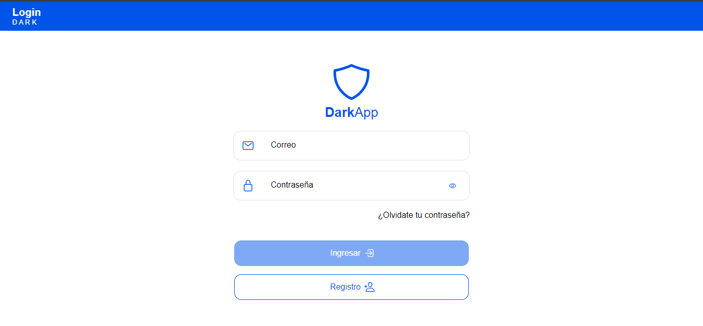
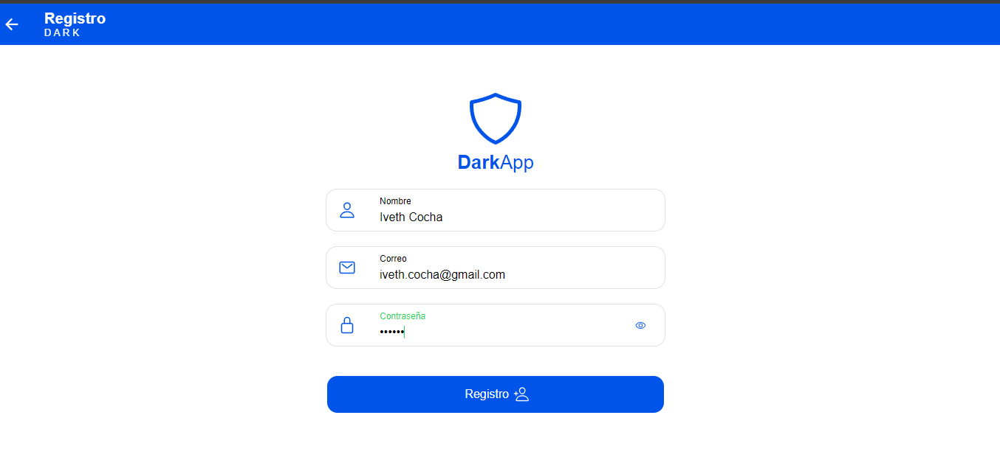
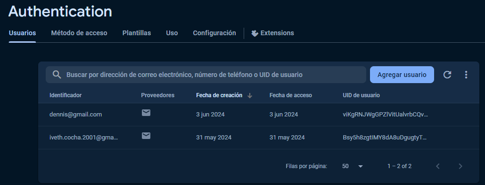
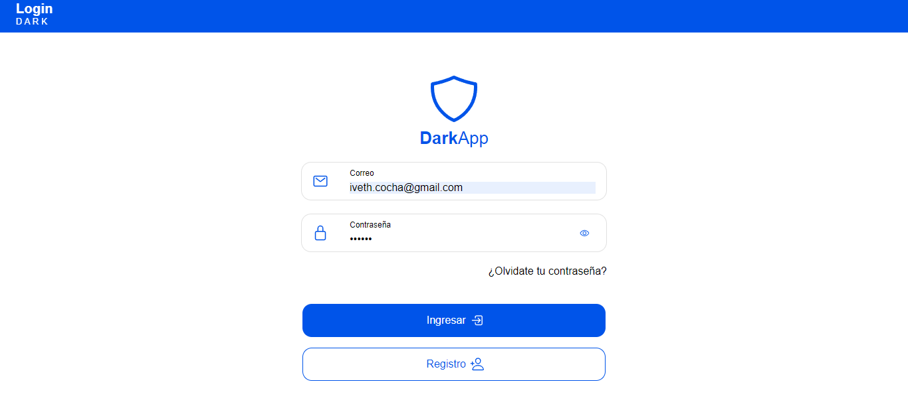
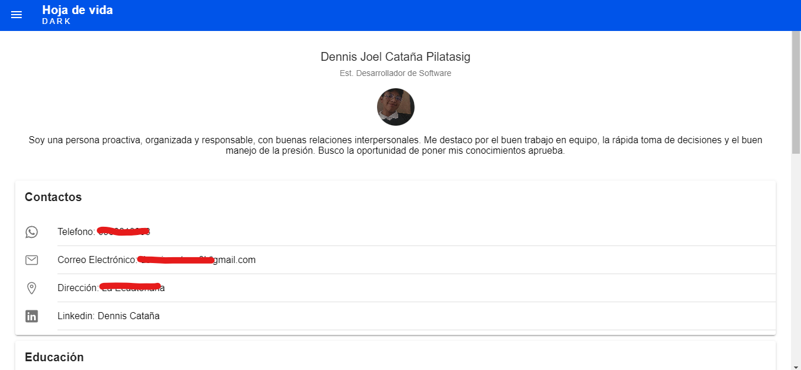

# Login y hoja de vida
## Para que el usuario pueda acceder a este aplicación debe seguir estos pasos.
1. Primero debera de clonarse este repositorio o descargar el zip del mismo.  

2. Una vez echo esto al usuario se le mostrara la estructura de este proyecto.  

3. Debera de ejecutar el comado nmp install para que se obtengan todas las librerias necesarias, una vez echo esto se mostrara un mensaje como este.  

4. Debera de tener un proyecto creado en Firebase con todo lo necesario. 

5. Se debera de poner sus credenciales en de firebase en los siguientes archivos los cuales estan en la ruta src/environments.
 - environment.ts  

 - environment.prod.ts 

6. Una vez realizada esta confihuraciones el usuario ejecutara el comando *ionic serve* y esperara a que en un navegadorse le muestre la siguiente pantalla.  

7. En este caso si no tiene un usuario registrado se procedera a crear uno y se procedera a verificar en firabse en autenticaciones se haya creado ese usuario.  
  

8. Debera de ingrear un gamil y contraseña solo como credenciales.  

9. Una vez adentro podra ver la hoja de vida de Dennis Cataña mensajes.  
